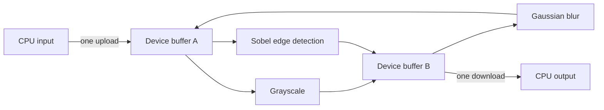

# CUDA Image Pipeline

[](https://isocpp.org/)
[](https://developer.nvidia.com/cuda-toolkit)
[](https://cmake.org/)

An educational CUDA/C++ image-processing pipeline built to explore a practical
GPU performance question:

> How much faster can image processing become when intermediate results stay on
> the GPU instead of crossing the CPU/GPU boundary after every filter?

The pipeline uploads an RGB image once, applies a configurable sequence of CUDA
kernels using reusable device buffers, and downloads the final image once. Each
implemented filter also has a single-threaded CPU reference, correctness checks,
and compute-only versus end-to-end benchmarks.

## Output gallery

These images were generated by the kernels in this repository, using the same
source image for an easy visual comparison.

<table>
  <tr>
    <th>Before grayscale</th>
    <th>After grayscale: color removed</th>
  </tr>
  <tr>
    <td></td>
    <td></td>
  </tr>
  <tr>
    <th>Before Gaussian blur</th>
    <th>After Gaussian blur: fine texture softened</th>
  </tr>
  <tr>
    <td></td>
    <td></td>
  </tr>
  <tr>
    <th>Before Sobel</th>
    <th>After Sobel: intensity edges highlighted</th>
  </tr>
  <tr>
    <td></td>
    <td></td>
  </tr>
  <tr>
    <th>Before heart bokeh</th>
    <th>After heart bokeh: stars spread into hearts</th>
  </tr>
  <tr>
    <td></td>
    <td></td>
  </tr>
</table>

The Gaussian comparison shows the same 120x80 brick crop at 4x nearest-neighbor
magnification, making the texture change visible without adding smoothing.
It is one pass of the actual 3x3 filter.
[Full original](assets/kodim01.png) and
[full blur output](docs/images/kodim01-gaussian-blur.png) are also available.
Sobel includes grayscale preparation. Bokeh uses threshold 200 and intensity
0.05; CPU and GPU outputs match exactly. Sharpen and resize have no gallery
entries because they are not implemented.

## Why use a pipeline?

PCIe transfers are expensive compared with these small kernels. Running every
filter as an isolated operation repeatedly pays that cost:

```text
CPU -> GPU -> grayscale -> CPU
CPU -> GPU -> blur      -> CPU
CPU -> GPU -> Sobel     -> CPU
```

This project keeps the image resident on the device:



Two device buffers alternate roles after each stage. One is read-only input
while the other receives the output, then they swap. This avoids repeated
allocation and prevents kernels from accidentally overwriting pixels they still
need to read.

## Implemented features

- RGB image loading and PNG output through `stb_image`
- RAII-managed device image storage
- Asynchronous transfers and kernel launches on a CUDA stream
- Ping-pong device buffers for multi-stage processing
- RGB-to-grayscale conversion
- 3x3 Gaussian blur
  - Global-memory comparison kernel
  - Shared-memory production kernel with halo loading
- 3x3 Sobel edge detection
  - Global-memory production kernel
  - Shared-memory experimental kernel
- Heart-shaped bokeh, available through a standalone CPU function, CUDA launcher,
  and benchmark (not yet a stage in `PipelineOptions`)
  - Fixed 21x20 aperture with 282 open samples and anchor (column 10, row 8)
  - One GPU thread per output pixel; aperture stored in CUDA constant memory
  - Inclusive luminance threshold and configurable intensity in [0,1]
  - Matching CPU/GPU rounding, border clipping, and saturation
- CPU reference implementations for correctness and performance comparisons
- Reusable CUDA-event and CPU timing helpers
- Automatic grayscale preparation for Sobel benchmark inputs
- Automated GPU tests with CTest

Sharpen and resize are currently documented extension points and are not yet
implemented.

## What does Sobel edge detection do?

Sobel looks at a 3x3 neighborhood around every pixel. One small matrix measures
brightness changes from left to right (`Gx`), while another measures changes from
top to bottom (`Gy`):

```text
Horizontal change (Gx)       Vertical change (Gy)

-1  0  1                    -1 -2 -1
-2  0  2                     0  0  0
-1  0  1                     1  2  1
```

The two measurements are combined into an edge strength. Flat regions become
dark; strong changes in brightness become bright outlines. In simple terms, it
turns “where the picture changes sharply” into visible lines.

Sobel expects grayscale intensity values. The benchmark checks whether an RGB
image already stores equal R, G, and B values. Color input is converted once
before timing; genuinely grayscale input skips that preparation.

## Benchmark results

Representative results from a Release build on an NVIDIA GeForce GTX 1060 3GB
with CUDA 12.9. Each measurement is the average of 20 runs over a 1960x1960 RGB
image (10.991 MiB). CPU references are single-threaded. All compared CPU and GPU
outputs matched exactly.

### End-to-end summary

| Filter | CPU reference | Production GPU kernel | Compute speedup | GPU end-to-end | End-to-end speedup |
|---|---:|---:|---:|---:|---:|
| Grayscale | 3.900 ms | 0.433 ms | 9.003x | 9.274 ms | 0.421x |
| Gaussian blur | 59.178 ms | 0.861 ms | 68.771x | 9.888 ms | 5.985x |
| Sobel edges | 28.501 ms | 0.625 ms | 45.588x | 10.032 ms | 2.841x |

“Compute speedup” compares only the algorithm running on the CPU or GPU.
“End-to-end” includes upload, kernel execution, download, and synchronization.
This distinction explains why the tiny grayscale kernel is much faster in
isolation but slower once transfers are included.

### Kernel optimization comparison

| Filter | Global memory | Shared memory | Result |
|---|---:|---:|---|
| Gaussian blur | 1.270 ms | 0.861 ms | Shared memory was 1.476x faster |
| Sobel edges | 0.625 ms | 0.681 ms | Global memory was about 1.09x faster |

Shared memory is an optimization tool, not a guaranteed speedup. Gaussian blur
reuses three color channels across neighboring threads, so cooperative tile
loading saves enough global-memory work to win. The Sobel kernel reads only one
channel from a small 3x3 neighborhood; hardware caching already handles that
pattern effectively, while tile loading and `__syncthreads()` add overhead.

The benchmark result therefore drives the production choice: Gaussian blur uses
the shared-memory implementation, while Sobel uses the global-memory version.
The slower Sobel implementation remains available as a documented experiment.

### Where GPU time goes

| Filter | Upload | Kernel | Download | Transfer share of measured components |
|---|---:|---:|---:|---:|
| Grayscale | 4.492 ms | 0.433 ms | 4.305 ms | 95.307% |
| Gaussian blur | 4.503 ms | 0.861 ms | 4.275 ms | 91.072% |
| Sobel edges | 4.668 ms | 0.625 ms | 4.280 ms | 93.469% |

The key takeaway is not merely that GPU kernels are fast. It is that a useful
GPU design must minimize data movement. Combining stages lets the pipeline pay
the large transfer cost once while doing more work between those transfers.

Results vary by GPU, CPU, image dimensions, compiler, clock behavior, and system
load. The benchmark executables accept any supported image so results can be
reproduced on another system.

### Heart bokeh measurements

Fresh measurements on an Intel Core i7-10700KF and NVIDIA GTX 1060 3GB,
driver 576.57, CUDA 12.9, Release build. Each row averages 20 timed runs
after CPU/GPU warm-up. Intensity is 0.05 throughout. CPU timing uses
`steady_clock`; GPU compute uses CUDA events. GPU end-to-end includes upload,
kernel, download and synchronization using reusable buffers. Allocation, image
loading and PNG writing are excluded. All measured outputs match byte-for-byte.

| Input | Dimensions | Threshold | CPU ms | GPU kernel ms | GPU end-to-end ms | Compute speedup |
|---|---:|---:|---:|---:|---:|---:|
| Synthetic lights | 480x270 | 200 | 65.491 | 1.196 | 1.681 | 54.8x |
| stars.jpg | 755x426 | 200 | 166.054 | 3.474 | 4.202 | 47.8x |
| kodim01.png | 768x512 | 200 | 202.917 | 3.027 | 4.315 | 67.0x |
| stars.jpg | 755x426 | 0 | 187.810 | 2.469 | 3.641 | 76.1x |
| stars.jpg | 755x426 | 255 | 162.679 | 2.772 | 3.576 | 58.7x |
| lena.jpg | 1960x1960 | 200 | 2000.360 | 30.470 | 38.512 | 65.6x |

These are workload observations, not isolated causal experiments or confidence
intervals. Clock changes, system load and content can affect timings. The older
grayscale/Gaussian/Sobel tables above are historical measurements, not fresh runs
from this sweep.

A separate 20-run repeat of stars at threshold 200 measured 170.789 ms CPU,
2.985 ms GPU and 4.082 ms GPU end-to-end, versus 3.474 ms GPU in the initial
batch. Treat small timing differences cautiously. Additional exploratory repeats
overlapped a background CPU benchmark and are excluded from the reported table.

Findings:

- Bokeh does substantially more work per pixel than the existing 3x3 filters.
  The measured GPU advantage persists after transfers.
- A higher threshold does not eliminate neighborhood reads: RGB and luminance
  must be obtained before rejecting a sample. On stars, threshold 0 was faster
  on the GPU than 200. More uniform branch behavior is one possible explanation;
  profiling is needed to separate it from clock/cache effects.
- This is an additive 2D effect, not depth of field. Large bright regions can
  saturate, and the original star remains at the center of the heart.
- The new near-square aperture replaces the earlier 29x14 ASCII-derived mask,
  whose proportions looked flattened when interpreted as square pixels.

### Would shared memory help bokeh?

It is a promising next experiment, but no shared-memory bokeh kernel has been
implemented or measured yet. This is an inference from the current access pattern:
each 16x16 block can inspect 256 x 282 = 72,192 source pixels, with substantial
overlap between neighboring threads. A bounding tile is only 36x35 RGB pixels
(3,780 bytes with byte storage). Because gathering subtracts aperture offsets,
the halo is 10 pixels left/right, 11 above, and 8 below.

Cooperatively loading that tile could reduce repeated global reads and allow
luminance/thresholding once per tile sample. The logical reuse is about 57x;
that is **not** a predicted speedup because caches already serve repeated reads.
Shared-memory accesses, synchronization, border loading, register pressure and
occupancy may offset the savings. Keep all threads participating in tile loading
and synchronization before returning threads outside the image.

Compare a tiled variant with this baseline on sparse stars, dense bright images,
and multiple sizes/thresholds. Require exact CPU agreement and measure both kernel
and end-to-end time before selecting the production version.

## Build

Requirements:

- Windows with Visual Studio 2022 and the Desktop C++ workload
- NVIDIA CUDA Toolkit 12.9
- CMake 3.22 or newer
- A CUDA-capable NVIDIA GPU

The current CMake configuration targets compute capability 6.1 for the GTX 1060.
Change `CMAKE_CUDA_ARCHITECTURES` when building for a different GPU generation.

```powershell
cmake -S . -B build
cmake --build build --config Release
```

## Run the pipeline

```powershell
.\build\Release\cuda_image_pipeline.exe `
    .\assets\kodim01.png `
    .\output\kodim01_pipeline.png
```

Both arguments are optional. The defaults are `assets/lena.jpg` and
`output/lena_pipeline.png`.

## Run the benchmarks

The grayscale, Gaussian and Sobel benchmarks accept an optional input path and fall back to
`assets/lena.jpg`:

```powershell
.\build\Release\benchmark_grayscale.exe .\assets\kodim01.png
.\build\Release\benchmark_gaussian_blur.exe .\assets\kodim01.png
.\build\Release\benchmark_sobel.exe .\assets\kodim01.png
```

Each benchmark:

1. Loads and validates the image.
2. Performs untimed input preparation when required.
3. Warms up the CPU and GPU implementations.
4. Measures CPU, kernel-only, and end-to-end time (the original three also report
   upload and download separately).
5. Compares CPU and GPU output byte-for-byte.
6. Saves both results under `output/` for visual inspection.

Heart bokeh accepts an image path or `--demo`, threshold, intensity, and run count:

```powershell
.\build\Release\benchmark_heart_bokeh.exe --demo 200 0.05 20
.\build\Release\benchmark_heart_bokeh.exe assets\stars.jpg 200 0.05 20
```

With no arguments it uses synthetic lights, threshold 200, intensity 0.35, and
five runs. It saves `*_bokeh_input.png`, `*_bokeh_cpu.png`, and
`*_bokeh_gpu.png` in `output/`. Reusing an input overwrites its previous results.
The program exits unsuccessfully if CPU/GPU output differs.

## Run the tests

```powershell
cmake --build build --config Release
ctest --test-dir build -C Release --output-on-failure
```

CTest currently runs six test executables, including the original filter and
pipeline tests plus separate CPU and GPU bokeh tests:

- **Grayscale:** known RGB values, already-gray input, dimensions that create
  partial CUDA blocks, and invalid image shapes
- **Gaussian blur:** solid-color preservation, a hand-calculated impulse
  response, comparison with the CPU reference, a one-pixel image, and invalid
  image shapes
- **Sobel:** solid images, a known vertical edge, black border behavior,
  global/shared-memory agreement on partial blocks, and invalid image shapes
- **Pipeline:** disabled stages, a single stage versus its direct launcher,
  grayscale-to-blur ordering, repeated calls, device-buffer reallocation, and
  invalid host input
- **CPU bokeh:** zero-intensity identity, black input, impulse sample count,
  notch/tip orientation, rounding, saturation, threshold rejection and invalid
  arguments
- **GPU bokeh:** 100 pattern comparisons across five shapes, four thresholds and
  five intensities; colored impulses at corners/center; black/white inputs;
  shared CPU/GPU argument rejection including overlap and nonfinite intensity

The small hand-calculated cases catch algorithm mistakes, while the 17x19 cases
exercise incomplete CUDA blocks at the image boundaries. CPU/GPU and
global/shared comparisons cover larger patterns without duplicating the kernel's
implementation inside the test.

## Project structure

```text
CudaLearning/
|-- CMakeLists.txt
|-- README.md
|-- assets/                    Input images
|-- docs/images/               README output examples
|-- include/
|   |-- benchmarks/            Shared benchmark infrastructure
|   |-- core/                  Host/device image types and CUDA checks
|   |-- filters/               Public filter launchers
|   |-- pipeline/              Pipeline configuration and interface
|   |-- reference/             Reusable CPU reference interfaces
|   `-- tests/                 Lightweight test helpers
|-- src/
|   |-- core/                  Image I/O and device-memory ownership
|   |-- filters/               CUDA kernels and launchers
|   |-- reference/             Independent CPU reference algorithms
|   `-- pipeline/              One-upload, one-download orchestration
|-- benchmarks/                CPU/GPU correctness and timing programs
|-- tests/                     Executable tests and learning outlines
`-- output/                    Generated images (ignored by Git)
```

## Next steps

- Integrate heart bokeh into `PipelineOptions` and test stage ordering
- Benchmark a shared-memory bokeh variant against the current global-read kernel

- Add tests alongside the sharpen and resize implementations
- Add nearest-neighbor and bilinear resize
- Add a sharpen filter and compare direct convolution with unsharp masking
- Benchmark the complete multi-filter pipeline against isolated filter calls
- Explore pinned host memory, kernel fusion, and CUDA Graphs
- Add Linux build verification and CI on a CUDA-capable runner

## Engineering focus

This repository is intentionally more than a collection of kernels. It explores
API boundaries, ownership, correctness, reproducible measurement, CPU/GPU data
movement, optimization tradeoffs, and evidence-based selection of production
implementations—the surrounding engineering needed to turn CUDA experiments
into a maintainable processing pipeline.
