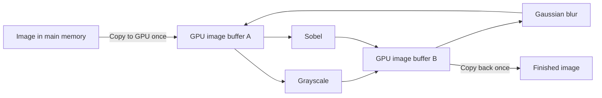

# CUDA Image Pipeline

**Image filters on the GPU, with the tests and timings to see how they work.**

[](https://isocpp.org/)
[](https://developer.nvidia.com/cuda-toolkit)
[](https://cmake.org/)

## TL;DR

I'm building this project to learn CUDA by making things I can actually see:
turning photos grayscale, softening details, finding edges, sharpening images,
and turning bright stars into hearts.

CUDA lets me run C++ code on an NVIDIA graphics card (GPU), where many pixels
can be processed at once. The interesting part is figuring out when that is
actually faster. Copying an image to and from the GPU takes time too.

The pipeline sends an image to the GPU once, applies the selected filters, and
brings the finished image back. **The goal is to spend more time processing
pixels and less time moving them around.**

For example, in the recorded grayscale benchmark, copying the image to the GPU
and back took about **8.8 ms**, while the filter itself took only **0.43 ms**.
That makes avoiding unnecessary copies just as important as writing a fast kernel.

| Measured highlight | Result on GTX 1060 3GB |
|---|---|
| Heart effect vs. the CPU version using one thread | **113.7x faster, including image transfers** |
| Gaussian blur vs. the CPU version using one thread | **68.8x faster processing · 6.0x including transfers** |
| Heart effect with pixels shared between nearby GPU threads | **2.88x faster processing** |
| Automated checks | **31 test functions in 7 test programs** |

These numbers average 20 runs on a 1960×1960 color image using CUDA 12.9 and a
Release build. Each filter was measured separately; measuring the complete
chain is still on the to-do list. [How the timings work](#performance-and-methodology).

### Build, run, test

Tested setup: **Windows · Visual Studio 2022 with Desktop C++ · CUDA 12.9 · CMake 3.22+**.
Open a terminal in the main project folder with CMake and the CUDA tools available.
The current build targets the GTX 1060 (`CMAKE_CUDA_ARCHITECTURES 61`); edit that
setting in [CMakeLists.txt](CMakeLists.txt) for another GPU architecture.

```powershell
cmake -S . -B build -DBUILD_TESTING=ON
cmake --build build --config Release
.\build\Release\cuda_image_pipeline.exe .\assets\kodim01.png .\output\pipeline.png
ctest --test-dir build -C Release --output-on-failure
```

This example removes color, blurs the image slightly, then highlights its edges
with Sobel. Open `output/pipeline.png` to see the result.

To choose different filters, edit the options in [src/main.cpp](src/main.cpp)
and rebuild. After the first setup, `.\run-tests.ps1` rebuilds and shows a short,
colored test summary. Add `-Verbose` to see every check and the build output.

[Gallery](#gallery) · [Architecture](#architecture) · [Filter status](#filter-status) ·
[Configuration](#configure-the-pipeline) · [Benchmarks](#performance-and-methodology) ·
[Tests](#correctness-and-test-coverage) · [Roadmap](#roadmap)

## Technical walkthrough

Here's how the pieces fit together, what I've measured, and what's still left
to build. The gallery is a good place to start if you're just here for the pictures.

### Gallery

These images were made with the filters in this project. Each pair shows the
original and the result of one effect, rather than stacking all the effects together.

<table>
  <tr><th colspan="2" align="center">Grayscale</th></tr>
  <tr><th align="center">Before</th><th align="center">After</th></tr>
  <tr>
    <td></td>
    <td></td>
  </tr>
  <tr><td colspan="2" align="center"><sub>Removes color while keeping the light and dark details.</sub></td></tr>
</table>

<table>
  <tr><th colspan="2" align="center">Gaussian blur</th></tr>
  <tr><th align="center">Before</th><th align="center">After</th></tr>
  <tr>
    <td></td>
    <td></td>
  </tr>
  <tr><td colspan="2" align="center"><sub>Softens the brick texture by blending each pixel with its neighbors. Both crops are enlarged 4× without extra smoothing so the difference is easier to see.</sub></td></tr>
</table>

<table>
  <tr><th colspan="2" align="center">Sobel edge detection</th></tr>
  <tr><th align="center">Before</th><th align="center">After</th></tr>
  <tr>
    <td></td>
    <td></td>
  </tr>
  <tr><td colspan="2" align="center"><sub>Finds edges where brightness changes quickly, making windows, bricks, and outlines stand out. The image is converted to grayscale first.</sub></td></tr>
</table>

<table>
  <tr><th colspan="2" align="center">Heart-shaped bokeh</th></tr>
  <tr><th align="center">Before</th><th align="center">After</th></tr>
  <tr>
    <td></td>
    <td></td>
  </tr>
  <tr><td colspan="2" align="center"><sub>Spreads bright pixels into little hearts using a 21×20 heart-shaped mask. Settings: brightness threshold 200, effect strength 0.05.</sub></td></tr>
</table>

[Full blur input](assets/kodim01.png) · [Full blur output](docs/images/kodim01-gaussian-blur.png).
Sharpen is implemented and tested; its gallery comparison is still to come.

### Architecture

An image lives in the computer's main memory when it is loaded. To process it
on the GPU, I first copy it into GPU memory. Once the filters finish, I copy it
back so it can be saved.

On a discrete graphics card like the GTX 1060, the CPU and GPU have separate
memory. These copies travel over **PCIe**, the connection between the graphics
card and the rest of the computer. That connection has limited bandwidth, and
each transfer also has setup overhead. Reading pixels already in GPU memory
avoids another trip across PCIe.

The 1960×1960 test image has three one-byte color channels per pixel, so each
copy moves **11,524,800 bytes (about 11 MiB)** of uncompressed pixel data. A small
JPEG file still expands to this full pixel array when loaded.

Doing those copies after every filter would add unnecessary work. Instead, the
image stays on the GPU until the whole chain is done. A GPU filter function is
called a **kernel**; this diagram shows the three used by the example program.



The two buffers are spaces in GPU memory that hold an image. Each filter reads
from one and writes to the other, then they swap roles. That matters for filters
like blur: changing a pixel before its neighbors have finished reading it would
give the wrong result. The pipeline reuses these buffers for images of the same
size and allocates new ones when the dimensions change.

For the C++ details: RAII handles GPU-memory cleanup, a CUDA stream keeps copies
and kernels in order, and CUDA events measure GPU time. The stb libraries load
and save images. Work is submitted asynchronously, but `process()` waits for
the finished image before returning. It does not process multiple images at once.

See [pipeline orchestration](src/pipeline/image_pipeline.cu) and
[device storage](src/core/device_image.cu).

### Filter status

A CPU reference is a version of the same filter that runs on the processor.
It gives me something to compare the GPU's pixels and speed against. A benchmark
measures how long that work takes.

| Stage | GPU implementation | CPU reference | Automated tests | Benchmark |
|---|---|---|---|---|
| Grayscale | Weighted RGB conversion | Yes | Yes | Yes |
| Gaussian blur | Shared-memory 3×3; global baseline in benchmark | Yes | Yes | Yes |
| Sobel | Global-memory 3×3; shared-memory comparison | Yes | Yes | Yes |
| Heart bokeh | Shared-memory gather; global comparison | Yes | Yes | Yes |
| Sharpen | Center pixel and four neighbors, adjustable strength | Planned | Yes | Planned |
| Resize | Placeholder only | Planned | Planned | Planned |

Sobel looks for changes in brightness. Enable grayscale before it when using
color photos. The Sobel benchmark handles that conversion before timing begins.

Sharpen uses `center + strength * (4 * center - north - south - east - west)`.
In other words, sharpen makes a pixel's difference from its neighbors stronger.
At an image edge, it reuses the nearest valid pixel. The result stays within
0–255, the range each red, green, or blue value can hold. Strength zero leaves
the image unchanged.

### Configure the pipeline

You can switch filters on and off. Enabled filters always run in this order:

```text
Grayscale → Gaussian blur → Heart bokeh → Sobel → Sharpen
```

Creating `PipelineOptions` enables grayscale and blur by default. The example
program also enables Sobel in [src/main.cpp](src/main.cpp). When running the
program, the first argument is the input file and the second is where to save
the result. Leave them out to use `assets/lena.jpg` and `output/lena_pipeline.png`.

For example, these settings sharpen an image while keeping its color:

```cpp
PipelineOptions options;
options.grayscale = false;
options.gaussianBlur = false;
options.sharpen = true;
options.sharpenStrength = 0.5f;

ImagePipeline pipeline(options);
HostImage output = pipeline.process(input);
```

For heart bokeh, use the same disabled grayscale/blur settings, enable
`options.heartBokeh`, and set `bokehThreshold = 200` and `bokehIntensity = 0.05f`.
Bokeh intensity must be finite and in [0, 1]. Bokeh and sharpen default to disabled.
Resize is next on the list. Enabling it currently produces an error because
the resizing code and differently sized output buffers are not implemented yet.

### Performance and methodology

Here are the recorded results on a GTX 1060 3GB using CUDA 12.9 and a Release
build. The first table averages 20 runs on a 1960×1960 RGB image (10.991 MiB).
Each CPU version uses one thread, and the CPU and GPU results matched exactly,
byte for byte. Your timings will depend on your hardware and the image.

Each row measures one filter. I still need to measure the full chain against
running filters separately, and add a benchmark for sharpen.

#### Individual-filter timings

| Filter | CPU reference | Production GPU kernel | Compute speedup | GPU end-to-end | End-to-end speedup |
|---|---:|---:|---:|---:|---:|
| Grayscale | 3.900 ms | 0.433 ms | 9.003x | 9.274 ms | 0.421x |
| Gaussian blur | 59.178 ms | 0.861 ms | 68.771x | 9.888 ms | 5.985x |
| Sobel edges | 28.501 ms | 0.625 ms | 45.588x | 10.032 ms | 2.841x |
| Heart bokeh | 2036.950 ms | 9.669 ms | 210.658x | 17.918 ms | 113.679x |

**Compute speedup** measures just the pixel-processing work. **End-to-end** also
counts copying the image to the GPU, copying it back, and waiting for completion.
It excludes loading and saving files. Larger speedup numbers are better; a value
below 1 means the GPU took longer.

Grayscale is a useful example: its GPU calculation is fast, but copying the image
takes enough time that the CPU finishes the whole job sooner.

#### Global vs. shared memory

Global memory holds the full image. Shared memory is a small workspace that a
group of GPU threads can use together. For filters that repeatedly read the same
nearby pixels, loading those pixels into shared memory can save work.

| Filter | Global memory | Shared memory | Result |
|---|---:|---:|---|
| Gaussian blur | 1.270 ms | 0.861 ms | Shared memory was 1.476x faster |
| Sobel edges | 0.625 ms | 0.681 ms | Global memory was about 1.09x faster |
| Heart bokeh | 27.890 ms | 9.669 ms | Shared memory was 2.884x faster |

Shared memory improved Gaussian blur and bokeh in these measurements, while
Sobel's global-memory kernel was faster. Gaussian blur reuses three channels
across neighboring threads; Sobel reads one channel from a small 3x3 neighborhood.
Cache reuse and tile-loading/synchronization overhead are plausible explanations
for the difference, but these timings alone do not establish the cause.

Based on these results, the pipeline uses shared memory for Gaussian blur and
global memory for Sobel. Both Sobel versions stay in the project so the comparison
can be repeated.

Bokeh uses shared memory as well: overlapping source reads and repeated
luminance checks are replaced by cooperative tile loading and thresholding.
Its global-memory launcher remains available for comparison.

#### Transfer costs

Here, **upload** means main memory → GPU memory, and **download** means GPU
memory → main memory. These are local memory copies, not network transfers.
All times below are in milliseconds (1 ms is one thousandth of a second).

| Filter | Upload | Kernel | Download | Transfer share of measured components |
|---|---:|---:|---:|---:|
| Grayscale | 4.492 ms | 0.433 ms | 4.305 ms | 95.307% |
| Gaussian blur | 4.503 ms | 0.861 ms | 4.275 ms | 91.072% |
| Sobel edges | 4.668 ms | 0.625 ms | 4.280 ms | 93.469% |
| Heart bokeh | 4.590 ms | 9.669 ms | 4.279 ms | 47.839% |

For grayscale, upload plus download is **4.492 + 4.305 = 8.797 ms**. That's
about **20 times the 0.433 ms kernel time**, and roughly **95%** of the three
measured components combined. The GPU finishes the arithmetic quickly; most
of the time goes into getting the pixels there and back.

This is why the pipeline keeps intermediate results on the GPU:

| Three filters applied to one image | Full-image copies across PCIe |
|---|---:|
| Upload and download around each filter | 6: three uploads + three downloads |
| Keep the image on the GPU between filters | 2: one upload + one download |

As a rough illustration, using the grayscale transfer timings for each copy
would give **26.4 ms of transfers** for three separate filters versus **8.8 ms**
for one chain. That's about **17.6 ms of copying avoided**. This is an estimate
from the individual-filter measurements, not a measured full-pipeline speedup.
The kernels still read and write GPU memory between stages.

The transfer-share column uses upload plus download divided by the sum of the
three listed timings. Those components are measured separately from end-to-end
wall time, so their sum need not equal the end-to-end result exactly. These
numbers describe this implementation and machine; they are not PCIe's maximum
bandwidth or a fixed cost for every image.

Results vary by GPU, CPU, image dimensions, compiler, clock behavior, and system
load. The benchmark executables accept any supported image so results can be
reproduced on another system.

#### Bokeh workload sweep

Recorded measurements on an Intel Core i7-10700KF and NVIDIA GTX 1060 3GB,
driver 576.57, CUDA 12.9, Release build. Each row averages 20 timed runs
after CPU/GPU warm-up. Intensity is 0.05 throughout. CPU timing uses
`steady_clock`; GPU compute uses CUDA events. GPU end-to-end includes upload,
kernel, download and synchronization using reusable buffers. Allocation, image
loading and PNG writing are excluded. All measured outputs match byte-for-byte.

| Input | Dimensions | Threshold | CPU ms | Global ms | Shared ms | Shared end-to-end ms | Global/shared |
|---|---:|---:|---:|---:|---:|---:|---:|
| Synthetic lights | 480x270 | 200 | 65.314 | 0.955 | 0.340 | 0.759 | 2.813x |
| stars.jpg | 755x426 | 200 | 164.819 | 2.436 | 0.831 | 1.716 | 2.933x |
| kodim01.png | 768x512 | 200 | 206.752 | 3.518 | 1.040 | 2.133 | 3.381x |
| stars.jpg | 755x426 | 0 | 182.027 | 2.000 | 0.744 | 1.629 | 2.687x |
| stars.jpg | 755x426 | 255 | 167.940 | 2.536 | 0.837 | 1.780 | 3.031x |
| lena.jpg | 1960x1960 | 200 | 2036.950 | 27.890 | 9.669 | 17.918 | 2.884x |

Each variant was warmed up;
global timing precedes shared timing. These are averages, not confidence
intervals or a block-size sweep. Clocks, caches and background load can affect
results; the speedup is consistent across the tested workloads.

Findings:

- Bokeh does substantially more work per pixel than the existing 3x3 filters.
  The measured GPU advantage persists after transfers.
- A higher threshold does not eliminate neighborhood reads: RGB and luminance
  must be obtained before rejecting a sample. On stars, threshold 0 was faster
  on the GPU than 200. More uniform branch behavior is one possible explanation;
  profiling is needed to separate it from clock/cache effects.
- This is an additive 2D effect, not depth of field. Large bright regions can
  saturate, and the original star remains at the center of the heart.
- The 21x20 aperture preserves the heart shape when rendered with square pixels.

#### Shared-memory bokeh design

The production launcher uses a 16x16 block (256 threads) with a 36x35
source tile. Halo widths are 10 left/right, 11 above and 8 below, matching the
asymmetric aperture and subtraction used for gathering. Each shared entry is a
32-bit packed RGB value, so the tile consumes 5,040 bytes per block.

Threads cooperatively load the tile and compute luminance/threshold once per
sample. Rejected samples and out-of-image entries become zero. All threads
synchronize before out-of-image output threads return, making partial blocks
safe. The gather loop then reads shared packed values and accumulates integer
RGB sums; rounding and compositing are unchanged.

16x16 is a conservative choice balancing halo overhead and block size. It is
not claimed to be optimal: 32x8 and other shapes have not been benchmarked.
The comparison measures both tiling and moving threshold work to tile loading,
rather than isolating shared-memory storage alone. The global launcher remains
available as a baseline.

Tests run the global, shared and default launchers against the CPU reference.
A previously recorded Compute Sanitizer memcheck run reported zero errors on
the bokeh GPU tests.


### Reproduce the benchmarks

From the repository root after a Release build:

```powershell
.\build\Release\benchmark_grayscale.exe .\assets\lena.jpg
.\build\Release\benchmark_gaussian_blur.exe .\assets\lena.jpg
.\build\Release\benchmark_sobel.exe .\assets\lena.jpg
.\build\Release\benchmark_heart_bokeh.exe .\assets\lena.jpg 200 0.05 20
```

The first three default to `assets/lena.jpg` when no path is supplied. Bokeh
accepts `image-path | --demo`, threshold, intensity, and run count:

```powershell
.\build\Release\benchmark_heart_bokeh.exe --demo 200 0.05 20
.\build\Release\benchmark_heart_bokeh.exe .\assets\stars.jpg 200 0.05 20
```

Without arguments, bokeh uses synthetic lights, threshold 200, intensity 0.35,
and five runs. Benchmarks warm up implementations, compare CPU/GPU pixels,
report timings, and save comparison images under `output/`. Repeated runs can
overwrite outputs. Loading and saving images are excluded from timed work.

### Correctness and test coverage

**31 test functions in 7 executables.** CTest counts each executable as one test;
functions can contain multiple assertions and input combinations.

| Suite | Functions | Coverage |
|---|---:|---|
| Grayscale | 4 | Known RGB values, grayscale identity, partial blocks, invalid shapes |
| Gaussian blur | 5 | Solid colors, known impulse, CPU agreement, 1×1 image, invalid shapes |
| Sobel | 5 | Flat image, known edge, black borders, global/shared agreement, invalid shapes |
| Pipeline | 7 | Disabled stages, stage ordering, bokeh integration, buffer reuse/reallocation, invalid input |
| Heart bokeh CPU | 2 | Zero intensity, impulse geometry, clipping, saturation, argument validation |
| Heart bokeh GPU | 2 | CPU agreement across input combinations and launchers, invalid arguments |
| Sharpen | 6 | 1×1 image, solid colors, known output, both clamp limits, zero strength |

For small images, I can calculate the expected pixels by hand and check the exact
answer. A 17×19 image also checks what happens when the image doesn't divide
evenly into the GPU's 16×16 groups of threads. For larger patterns, four filters
have CPU versions to compare against. This helps catch mistakes that are easy
to miss by looking at a photo.

```powershell
# Rebuild, then show the short colored summary.
.\run-tests.ps1

# Include build output and each test function's result.
.\run-tests.ps1 -Verbose

# Run only sharpen using the existing build.
ctest --test-dir build -C Release -R "^sharpen$" --output-on-failure
```

The PowerShell runner stops on build failure and preserves CTest's exit code.
Direct `cmake --build` and `ctest` commands from the quick start are also available.

### Repository map

```text
CudaLearning/
├── CMakeLists.txt       Build targets and CTest registration
├── run-tests.ps1        Rebuild + colored test reporting
├── src/
│   ├── core/           Image I/O and device-memory ownership
│   ├── filters/        CUDA kernels and launchers
│   ├── pipeline/       GPU-resident stage orchestration
│   └── reference/      CPU reference implementations
├── include/            Public interfaces and shared test/benchmark helpers
├── tests/              Automated correctness checks
├── benchmarks/         CPU/GPU timing and output comparisons
├── examples/           Pipeline API usage examples
├── assets/             Input images
├── docs/               Gallery images and supporting illustrations
├── third_party/        Shared stb image headers
├── learning/           Original standalone CUDA exercises
├── build/              Generated build files (ignored)
└── output/             Generated result images (ignored)
```

I kept the original exercises in [learning/](learning/README.md), from adding
vectors to the first standalone image filters. They show where the project
started and can be built separately from the current pipeline.

### Roadmap

- **Next:** basic nearest-neighbor resize, buffers for the new image size, and tests.
- **Sharpen:** CPU reference, benchmark, and a before/after gallery comparison.
- **Measurement:** compare a full filter chain with running filters separately; try different bokeh thread-group shapes.
- **Exploration:** bilinear resize, pinned host memory, kernel fusion, and CUDA Graphs.
- **Portability:** Linux build verification and GPU-backed CI.
