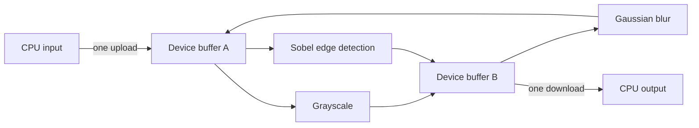

# CUDA Image Pipeline

[](https://isocpp.org/)
[](https://developer.nvidia.com/cuda-toolkit)
[](https://cmake.org/)

An educational CUDA/C++ image-processing pipeline built to explore a practical
GPU performance question:

> How much faster can image processing become when intermediate results stay on
> the GPU instead of crossing the CPU/GPU boundary after every filter?

The pipeline uploads an RGB image once, applies a configurable sequence of CUDA
kernels using reusable device buffers, and downloads the final image once. Each
implemented filter also has a single-threaded CPU reference, correctness checks,
and compute-only versus end-to-end benchmarks.

## Output gallery

These images were generated by the kernels in this repository, using the same
source image for an easy visual comparison.

<table>
  <tr>
    <th>Original</th>
    <th>Grayscale</th>
  </tr>
  <tr>
    <td></td>
    <td></td>
  </tr>
  <tr>
    <th>Gaussian blur</th>
    <th>Sobel edges</th>
  </tr>
  <tr>
    <td></td>
    <td></td>
  </tr>
</table>

## Why use a pipeline?

PCIe transfers are expensive compared with these small kernels. Running every
filter as an isolated operation repeatedly pays that cost:

```text
CPU -> GPU -> grayscale -> CPU
CPU -> GPU -> blur      -> CPU
CPU -> GPU -> Sobel     -> CPU
```

This project keeps the image resident on the device:



Two device buffers alternate roles after each stage. One is read-only input
while the other receives the output, then they swap. This avoids repeated
allocation and prevents kernels from accidentally overwriting pixels they still
need to read.

## Implemented features

- RGB image loading and PNG output through `stb_image`
- RAII-managed device image storage
- Asynchronous transfers and kernel launches on a CUDA stream
- Ping-pong device buffers for multi-stage processing
- RGB-to-grayscale conversion
- 3x3 Gaussian blur
  - Global-memory comparison kernel
  - Shared-memory production kernel with halo loading
- 3x3 Sobel edge detection
  - Global-memory production kernel
  - Shared-memory experimental kernel
- CPU reference implementations for correctness and performance comparisons
- Reusable CUDA-event and CPU timing helpers
- Automatic grayscale preparation for Sobel benchmark inputs
- Automated GPU tests with CTest

Sharpen and resize are currently documented extension points and are not yet
implemented.

## What does Sobel edge detection do?

Sobel looks at a 3x3 neighborhood around every pixel. One small matrix measures
brightness changes from left to right (`Gx`), while another measures changes from
top to bottom (`Gy`):

```text
Horizontal change (Gx)       Vertical change (Gy)

-1  0  1                    -1 -2 -1
-2  0  2                     0  0  0
-1  0  1                     1  2  1
```

The two measurements are combined into an edge strength. Flat regions become
dark; strong changes in brightness become bright outlines. In simple terms, it
turns “where the picture changes sharply” into visible lines.

Sobel expects grayscale intensity values. The benchmark checks whether an RGB
image already stores equal R, G, and B values. Color input is converted once
before timing; genuinely grayscale input skips that preparation.

## Benchmark results

Representative results from a Release build on an NVIDIA GeForce GTX 1060 3GB
with CUDA 12.9. Each measurement is the average of 20 runs over a 1960x1960 RGB
image (10.991 MiB). CPU references are single-threaded. All compared CPU and GPU
outputs matched exactly.

### End-to-end summary

| Filter | CPU reference | Production GPU kernel | Compute speedup | GPU end-to-end | End-to-end speedup |
|---|---:|---:|---:|---:|---:|
| Grayscale | 3.900 ms | 0.433 ms | 9.003x | 9.274 ms | 0.421x |
| Gaussian blur | 59.178 ms | 0.861 ms | 68.771x | 9.888 ms | 5.985x |
| Sobel edges | 28.501 ms | 0.625 ms | 45.588x | 10.032 ms | 2.841x |

“Compute speedup” compares only the algorithm running on the CPU or GPU.
“End-to-end” includes upload, kernel execution, download, and synchronization.
This distinction explains why the tiny grayscale kernel is much faster in
isolation but slower once transfers are included.

### Kernel optimization comparison

| Filter | Global memory | Shared memory | Result |
|---|---:|---:|---|
| Gaussian blur | 1.270 ms | 0.861 ms | Shared memory was 1.476x faster |
| Sobel edges | 0.625 ms | 0.681 ms | Global memory was about 1.09x faster |

Shared memory is an optimization tool, not a guaranteed speedup. Gaussian blur
reuses three color channels across neighboring threads, so cooperative tile
loading saves enough global-memory work to win. The Sobel kernel reads only one
channel from a small 3x3 neighborhood; hardware caching already handles that
pattern effectively, while tile loading and `__syncthreads()` add overhead.

The benchmark result therefore drives the production choice: Gaussian blur uses
the shared-memory implementation, while Sobel uses the global-memory version.
The slower Sobel implementation remains available as a documented experiment.

### Where GPU time goes

| Filter | Upload | Kernel | Download | Transfer share of measured components |
|---|---:|---:|---:|---:|
| Grayscale | 4.492 ms | 0.433 ms | 4.305 ms | 95.307% |
| Gaussian blur | 4.503 ms | 0.861 ms | 4.275 ms | 91.072% |
| Sobel edges | 4.668 ms | 0.625 ms | 4.280 ms | 93.469% |

The key takeaway is not merely that GPU kernels are fast. It is that a useful
GPU design must minimize data movement. Combining stages lets the pipeline pay
the large transfer cost once while doing more work between those transfers.

Results vary by GPU, CPU, image dimensions, compiler, clock behavior, and system
load. The benchmark executables accept any supported image so results can be
reproduced on another system.

## Build

Requirements:

- Windows with Visual Studio 2022 and the Desktop C++ workload
- NVIDIA CUDA Toolkit 12.9
- CMake 3.22 or newer
- A CUDA-capable NVIDIA GPU

The current CMake configuration targets compute capability 6.1 for the GTX 1060.
Change `CMAKE_CUDA_ARCHITECTURES` when building for a different GPU generation.

```powershell
cmake -S . -B build
cmake --build build --config Release
```

## Run the pipeline

```powershell
.\build\Release\cuda_image_pipeline.exe `
    .\assets\kodim01.png `
    .\output\kodim01_pipeline.png
```

Both arguments are optional. The defaults are `assets/lena.jpg` and
`output/lena_pipeline.png`.

## Run the benchmarks

Every benchmark accepts an optional input path and falls back to
`assets/lena.jpg`:

```powershell
.\build\Release\benchmark_grayscale.exe .\assets\kodim01.png
.\build\Release\benchmark_gaussian_blur.exe .\assets\kodim01.png
.\build\Release\benchmark_sobel.exe .\assets\kodim01.png
```

Each benchmark:

1. Loads and validates the image.
2. Performs untimed input preparation when required.
3. Warms up the CPU and GPU implementations.
4. Measures CPU, kernel-only, transfer, and end-to-end time.
5. Compares CPU and GPU output byte-for-byte.
6. Saves both results under `output/` for visual inspection.

## Run the tests

```powershell
cmake --build build --config Release
ctest --test-dir build -C Release --output-on-failure
```

Current automated reference tests:

- Known RGB-to-grayscale values
- Gaussian blur preserves a solid-color 19x17 image
- Global- and shared-memory Sobel produce no edges for a solid image
- A pipeline with every stage disabled preserves its input

Additional test outlines are included for border handling, partial CUDA blocks,
known Sobel patterns, global/shared agreement, stage ordering, repeated calls,
buffer reallocation, and invalid inputs.

## Project structure

```text
CudaLearning/
|-- CMakeLists.txt
|-- README.md
|-- assets/                    Input images
|-- docs/images/               README output examples
|-- include/
|   |-- benchmarks/            Shared benchmark infrastructure
|   |-- core/                  Host/device image types and CUDA checks
|   |-- filters/               Public filter launchers
|   |-- pipeline/              Pipeline configuration and interface
|   `-- tests/                 Lightweight test helpers
|-- src/
|   |-- core/                  Image I/O and device-memory ownership
|   |-- filters/               CUDA kernels and launchers
|   `-- pipeline/              One-upload, one-download orchestration
|-- benchmarks/                CPU/GPU correctness and timing programs
|-- tests/                     Executable tests and learning outlines
`-- output/                    Generated images (ignored by Git)
```

## Next steps

- Complete the remaining outlined correctness tests
- Add nearest-neighbor and bilinear resize
- Add a sharpen filter and compare direct convolution with unsharp masking
- Benchmark the complete multi-filter pipeline against isolated filter calls
- Explore pinned host memory, kernel fusion, and CUDA Graphs
- Add Linux build verification and CI on a CUDA-capable runner

## Engineering focus

This repository is intentionally more than a collection of kernels. It explores
API boundaries, ownership, correctness, reproducible measurement, CPU/GPU data
movement, optimization tradeoffs, and evidence-based selection of production
implementations—the surrounding engineering needed to turn CUDA experiments
into a maintainable processing pipeline.
