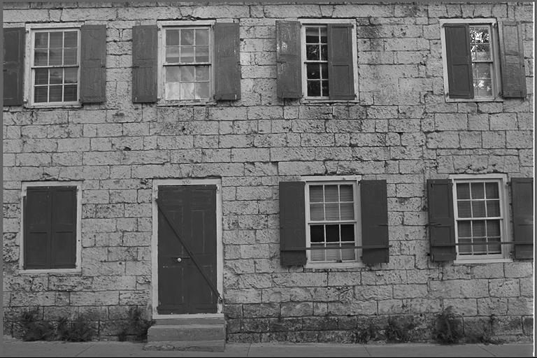
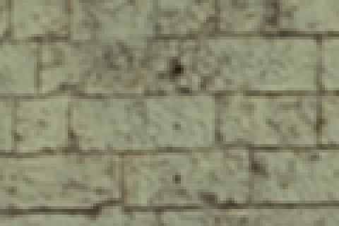
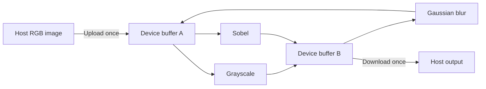

# CUDA Image Pipeline

**One upload. Five GPU filters. One download.**

[](https://isocpp.org/)
[](https://developer.nvidia.com/cuda-toolkit)
[](https://cmake.org/)

## TL;DR

A C++/CUDA image-processing project exploring **when GPU acceleration pays off**:
keep images on the GPU between filters, compare memory strategies, and measure
transfer costs alongside kernel speed. Implemented stages include grayscale,
Gaussian blur, Sobel edges, heart-shaped bokeh, and sharpen.

| Measured highlight | Result on GTX 1060 3GB |
|---|---|
| Heart bokeh vs. single-threaded CPU | **113.7x end-to-end speedup** |
| Gaussian blur vs. single-threaded CPU | **68.8x kernel speedup · 6.0x end-to-end** |
| Shared-memory bokeh vs. global-memory bokeh | **2.88x faster kernel** |
| Correctness coverage | **31 test functions across 7 CTest executables** |

Timing highlights are recorded averages of 20 runs on a 1960x1960 RGB image,
CUDA 12.9, Release build. They measure **individual filters**, not the full
multi-stage pipeline. [Methodology and full results](#performance-and-methodology).

### Build, run, test

Tested setup: **Windows · Visual Studio 2022 with Desktop C++ · CUDA 12.9 · CMake 3.22+**.
Use a terminal with CMake and the CUDA toolchain available, from the repository root.
The current build targets the GTX 1060 (`CMAKE_CUDA_ARCHITECTURES 61`); edit that
setting in [CMakeLists.txt](CMakeLists.txt) for another GPU architecture.

```powershell
cmake -S . -B build -DBUILD_TESTING=ON
cmake --build build --config Release
.\build\Release\cuda_image_pipeline.exe .\assets\kodim01.png .\output\pipeline.png
ctest --test-dir build -C Release --output-on-failure
```

The executable runs **grayscale → Gaussian blur → Sobel** and writes a PNG.
Filters are configured in C++, not through command-line flags. After initial
configuration, `.\run-tests.ps1` rebuilds and shows a colored test summary;
`.\run-tests.ps1 -Verbose` includes every check and build output.

[Gallery](#gallery) · [Architecture](#architecture) · [Filter status](#filter-status) ·
[Configuration](#configure-the-pipeline) · [Benchmarks](#performance-and-methodology) ·
[Tests](#correctness-and-test-coverage) · [Roadmap](#roadmap)

## Technical walkthrough

### Gallery

Outputs from this repository's kernels. Each pair uses the same source image;
these are individual effects, not successive stages of one chain.

<table>
  <tr><th colspan="2" align="center">Grayscale</th></tr>
  <tr><th align="center">Before</th><th align="center">After</th></tr>
  <tr>
    <td></td>
    <td></td>
  </tr>
  <tr><td colspan="2" align="center"><sub>Weighted RGB luminance removes color while preserving brightness detail.</sub></td></tr>
</table>

<table>
  <tr><th colspan="2" align="center">Gaussian blur</th></tr>
  <tr><th align="center">Before</th><th align="center">After</th></tr>
  <tr>
    <td></td>
    <td></td>
  </tr>
  <tr><td colspan="2" align="center"><sub>One 3×3 pass softens fine texture. The same 120×80 crop is enlarged 4× with nearest-neighbor sampling.</sub></td></tr>
</table>

<table>
  <tr><th colspan="2" align="center">Sobel edge detection</th></tr>
  <tr><th align="center">Before</th><th align="center">After</th></tr>
  <tr>
    <td></td>
    <td></td>
  </tr>
  <tr><td colspan="2" align="center"><sub>Grayscale preparation followed by Sobel reveals strong brightness transitions.</sub></td></tr>
</table>

<table>
  <tr><th colspan="2" align="center">Heart-shaped bokeh</th></tr>
  <tr><th align="center">Before</th><th align="center">After</th></tr>
  <tr>
    <td></td>
    <td></td>
  </tr>
  <tr><td colspan="2" align="center"><sub>A 21×20 heart aperture spreads bright highlights. Threshold: 200; intensity: 0.05. This is an additive 2D effect.</sub></td></tr>
</table>

[Full blur input](assets/kodim01.png) · [Full blur output](docs/images/kodim01-gaussian-blur.png).
Sharpen is implemented and tested; its gallery comparison is still to come.

### Architecture

The central design question is how much work can be done between a single
upload and download. A fast kernel alone does not guarantee a faster application:
for grayscale, transfers dominate the recorded GPU time.



This diagram shows the executable's default chain. Two device buffers alternate
input and output roles after each enabled stage. Neighbor-reading kernels never
need to overwrite their own input, and buffers are reused across calls with the
same dimensions. Dimension changes trigger reallocation.

The implementation includes RAII-managed device storage, a nonblocking CUDA
stream, asynchronous copy/launch calls, CUDA-event timing, and RGB image I/O
through stb. `process()` synchronizes before returning the host result; the
asynchronous calls do not imply overlap between separate images.

See [pipeline orchestration](src/pipeline/image_pipeline.cu) and
[device storage](src/core/device_image.cu).

### Filter status

| Stage | GPU implementation | CPU reference | Automated tests | Benchmark |
|---|---|---|---|---|
| Grayscale | Weighted RGB conversion | Yes | Yes | Yes |
| Gaussian blur | Shared-memory 3×3; global baseline in benchmark | Yes | Yes | Yes |
| Sobel | Global-memory 3×3; shared-memory comparison | Yes | Yes | Yes |
| Heart bokeh | Shared-memory gather; global comparison | Yes | Yes | Yes |
| Sharpen | Adjustable five-point stencil, per RGB channel | Planned | Yes | Planned |
| Resize | Placeholder only | Planned | Planned | Planned |

Sobel reads grayscale intensity and writes RGB output. Its benchmark performs
untimed grayscale preparation for color input; when configuring a pipeline,
enable grayscale before Sobel if that is the intended effect.

Sharpen uses `center + strength * (4 * center - north - south - east - west)`.
Neighbor coordinates clamp to the image boundary, and output values clamp to
0–255. Zero strength preserves the input.

### Configure the pipeline

The stage order is fixed; options enable or disable stages:

```text
Grayscale → Gaussian blur → Heart bokeh → Sobel → Sharpen
```

The API defaults enable grayscale and Gaussian blur. The executable additionally
enables Sobel in [src/main.cpp](src/main.cpp). Its two optional arguments are
input/output paths, defaulting to `assets/lena.jpg` and `output/lena_pipeline.png`.

For a color-preserving sharpen pass:

```cpp
PipelineOptions options;
options.grayscale = false;
options.gaussianBlur = false;
options.sharpen = true;
options.sharpenStrength = 0.5f;

ImagePipeline pipeline(options);
HostImage output = pipeline.process(input);
```

For heart bokeh, use the same disabled grayscale/blur settings, enable
`options.heartBokeh`, and set `bokehThreshold = 200` and `bokehIntensity = 0.05f`.
Bokeh intensity must be finite and in [0, 1]. Bokeh and sharpen default to disabled.
Resize currently throws when enabled; it still needs a kernel and output-buffer
allocation for the requested dimensions.

### Performance and methodology

The tables below preserve recorded measurements; they are not a live benchmark
or a claim about every GPU. The summary uses a GTX 1060 3GB, CUDA 12.9, Release
build, a 1960×1960 RGB image (10.991 MiB), and averages over 20 runs. CPU references
are single-threaded; all compared CPU/GPU outputs matched byte-for-byte.
The bokeh workload sweep includes additional hardware and timing details below.

**Scope:** these are per-filter results. A full pipeline versus repeated host
round-trips benchmark is still planned. Sharpen has no recorded benchmark yet.

#### Individual-filter timings

| Filter | CPU reference | Production GPU kernel | Compute speedup | GPU end-to-end | End-to-end speedup |
|---|---:|---:|---:|---:|---:|
| Grayscale | 3.900 ms | 0.433 ms | 9.003x | 9.274 ms | 0.421x |
| Gaussian blur | 59.178 ms | 0.861 ms | 68.771x | 9.888 ms | 5.985x |
| Sobel edges | 28.501 ms | 0.625 ms | 45.588x | 10.032 ms | 2.841x |
| Heart bokeh | 2036.950 ms | 9.669 ms | 210.658x | 17.918 ms | 113.679x |

“Compute speedup” compares only the algorithm running on the CPU or GPU.
“End-to-end” includes upload, kernel execution, download, and synchronization.
This distinction explains why the tiny grayscale kernel is much faster in
isolation but slower once transfers are included.

#### Global vs. shared memory

| Filter | Global memory | Shared memory | Result |
|---|---:|---:|---|
| Gaussian blur | 1.270 ms | 0.861 ms | Shared memory was 1.476x faster |
| Sobel edges | 0.625 ms | 0.681 ms | Global memory was about 1.09x faster |
| Heart bokeh | 27.890 ms | 9.669 ms | Shared memory was 2.884x faster |

Shared memory improved Gaussian blur and bokeh in these measurements, while
Sobel's global-memory kernel was faster. Gaussian blur reuses three channels
across neighboring threads; Sobel reads one channel from a small 3x3 neighborhood.
Cache reuse and tile-loading/synchronization overhead are plausible explanations
for the difference, but these timings alone do not establish the cause.

The benchmark result therefore drives the production choice: Gaussian blur uses
the shared-memory implementation, while Sobel uses the global-memory version.
The slower Sobel implementation remains available as a documented experiment.

Bokeh uses shared memory as well: overlapping source reads and repeated
luminance checks are replaced by cooperative tile loading and thresholding.
Its global-memory launcher remains available for comparison.

#### Transfer costs

| Filter | Upload | Kernel | Download | Transfer share of measured components |
|---|---:|---:|---:|---:|
| Grayscale | 4.492 ms | 0.433 ms | 4.305 ms | 95.307% |
| Gaussian blur | 4.503 ms | 0.861 ms | 4.275 ms | 91.072% |
| Sobel edges | 4.668 ms | 0.625 ms | 4.280 ms | 93.469% |
| Heart bokeh | 4.590 ms | 9.669 ms | 4.279 ms | 47.839% |

Transfer costs motivate the pipeline design: combining stages pays for one
upload and one download while doing more work between them. The transfer-share
column uses upload plus download divided by the sum of the three listed timings;
those components are measured separately from end-to-end wall time.

Results vary by GPU, CPU, image dimensions, compiler, clock behavior, and system
load. The benchmark executables accept any supported image so results can be
reproduced on another system.

#### Bokeh workload sweep

Recorded measurements on an Intel Core i7-10700KF and NVIDIA GTX 1060 3GB,
driver 576.57, CUDA 12.9, Release build. Each row averages 20 timed runs
after CPU/GPU warm-up. Intensity is 0.05 throughout. CPU timing uses
`steady_clock`; GPU compute uses CUDA events. GPU end-to-end includes upload,
kernel, download and synchronization using reusable buffers. Allocation, image
loading and PNG writing are excluded. All measured outputs match byte-for-byte.

| Input | Dimensions | Threshold | CPU ms | Global ms | Shared ms | Shared end-to-end ms | Global/shared |
|---|---:|---:|---:|---:|---:|---:|---:|
| Synthetic lights | 480x270 | 200 | 65.314 | 0.955 | 0.340 | 0.759 | 2.813x |
| stars.jpg | 755x426 | 200 | 164.819 | 2.436 | 0.831 | 1.716 | 2.933x |
| kodim01.png | 768x512 | 200 | 206.752 | 3.518 | 1.040 | 2.133 | 3.381x |
| stars.jpg | 755x426 | 0 | 182.027 | 2.000 | 0.744 | 1.629 | 2.687x |
| stars.jpg | 755x426 | 255 | 167.940 | 2.536 | 0.837 | 1.780 | 3.031x |
| lena.jpg | 1960x1960 | 200 | 2036.950 | 27.890 | 9.669 | 17.918 | 2.884x |

Each variant was warmed up;
global timing precedes shared timing. These are averages, not confidence
intervals or a block-size sweep. Clocks, caches and background load can affect
results; the speedup is consistent across the tested workloads.

Findings:

- Bokeh does substantially more work per pixel than the existing 3x3 filters.
  The measured GPU advantage persists after transfers.
- A higher threshold does not eliminate neighborhood reads: RGB and luminance
  must be obtained before rejecting a sample. On stars, threshold 0 was faster
  on the GPU than 200. More uniform branch behavior is one possible explanation;
  profiling is needed to separate it from clock/cache effects.
- This is an additive 2D effect, not depth of field. Large bright regions can
  saturate, and the original star remains at the center of the heart.
- The 21x20 aperture preserves the heart shape when rendered with square pixels.

#### Shared-memory bokeh design

The production launcher uses a 16x16 block (256 threads) with a 36x35
source tile. Halo widths are 10 left/right, 11 above and 8 below, matching the
asymmetric aperture and subtraction used for gathering. Each shared entry is a
32-bit packed RGB value, so the tile consumes 5,040 bytes per block.

Threads cooperatively load the tile and compute luminance/threshold once per
sample. Rejected samples and out-of-image entries become zero. All threads
synchronize before out-of-image output threads return, making partial blocks
safe. The gather loop then reads shared packed values and accumulates integer
RGB sums; rounding and compositing are unchanged.

16x16 is a conservative choice balancing halo overhead and block size. It is
not claimed to be optimal: 32x8 and other shapes have not been benchmarked.
The comparison measures both tiling and moving threshold work to tile loading,
rather than isolating shared-memory storage alone. The global launcher remains
available as a baseline.

Tests run the global, shared and default launchers against the CPU reference.
A previously recorded Compute Sanitizer memcheck run reported zero errors on
the bokeh GPU tests.


### Reproduce the benchmarks

From the repository root after a Release build:

```powershell
.\build\Release\benchmark_grayscale.exe .\assets\lena.jpg
.\build\Release\benchmark_gaussian_blur.exe .\assets\lena.jpg
.\build\Release\benchmark_sobel.exe .\assets\lena.jpg
.\build\Release\benchmark_heart_bokeh.exe .\assets\lena.jpg 200 0.05 20
```

The first three default to `assets/lena.jpg` when no path is supplied. Bokeh
accepts `image-path | --demo`, threshold, intensity, and run count:

```powershell
.\build\Release\benchmark_heart_bokeh.exe --demo 200 0.05 20
.\build\Release\benchmark_heart_bokeh.exe .\assets\stars.jpg 200 0.05 20
```

Without arguments, bokeh uses synthetic lights, threshold 200, intensity 0.35,
and five runs. Benchmarks warm up implementations, compare CPU/GPU pixels,
report timings, and save comparison images under `output/`. Repeated runs can
overwrite outputs. Loading and saving images are excluded from timed work.

### Correctness and test coverage

**31 test functions in 7 executables.** CTest counts each executable as one test;
functions can contain multiple assertions and input combinations.

| Suite | Functions | Coverage |
|---|---:|---|
| Grayscale | 4 | Known RGB values, grayscale identity, partial blocks, invalid shapes |
| Gaussian blur | 5 | Solid colors, known impulse, CPU agreement, 1×1 image, invalid shapes |
| Sobel | 5 | Flat image, known edge, black borders, global/shared agreement, invalid shapes |
| Pipeline | 7 | Disabled stages, stage ordering, bokeh integration, buffer reuse/reallocation, invalid input |
| Heart bokeh CPU | 2 | Zero intensity, impulse geometry, clipping, saturation, argument validation |
| Heart bokeh GPU | 2 | CPU agreement across input combinations and launchers, invalid arguments |
| Sharpen | 6 | 1×1 image, solid colors, known output, both clamp limits, zero strength |

Small hand-calculated images make expected results inspectable. Dimensions such
as 17×19 exercise partial 16×16 thread blocks. CPU-reference comparisons cover
larger patterns for the four filters with reference implementations.

```powershell
# Rebuild, then show the short colored summary.
.\run-tests.ps1

# Include build output and each test function's result.
.\run-tests.ps1 -Verbose

# Run only sharpen using the existing build.
ctest --test-dir build -C Release -R "^sharpen$" --output-on-failure
```

The PowerShell runner stops on build failure and preserves CTest's exit code.
Direct `cmake --build` and `ctest` commands from the quick start are also available.

### Repository map

```text
CudaLearning/
├── CMakeLists.txt       Build targets and CTest registration
├── run-tests.ps1        Rebuild + colored test reporting
├── src/
│   ├── core/           Image I/O and device-memory ownership
│   ├── filters/        CUDA kernels and launchers
│   ├── pipeline/       GPU-resident stage orchestration
│   └── reference/      CPU reference implementations
├── include/            Public interfaces and shared test/benchmark helpers
├── tests/              Automated correctness checks
├── benchmarks/         CPU/GPU timing and output comparisons
├── examples/           Pipeline API usage examples
├── assets/             Input images
├── docs/               Gallery images and supporting illustrations
├── third_party/        Shared stb image headers
├── learning/           Original standalone CUDA exercises
├── build/              Generated build files (ignored)
└── output/             Generated result images (ignored)
```

The [learning archive](learning/README.md) preserves the progression from vector
addition and standalone image kernels to the current library. It is separate
from the main CMake build.

### Roadmap

- **Next:** nearest-neighbor resize, dimension-aware pipeline allocation, and tests.
- **Sharpen:** CPU reference, benchmark, and a before/after gallery comparison.
- **Measurement:** complete pipeline versus isolated filter calls; bokeh block-shape profiling.
- **Exploration:** bilinear resize, pinned host memory, kernel fusion, and CUDA Graphs.
- **Portability:** Linux build verification and GPU-backed CI.
