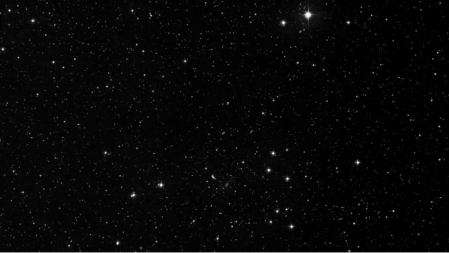
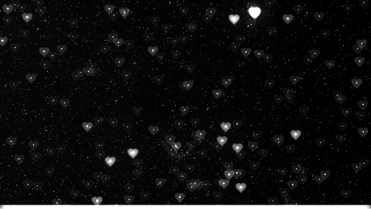

<div align="center">

# ⋆｡°✩  CUDA Image Pipeline  ✩°｡⋆

### A GPU image processing pipeline built for correctness and performance

This C++ and CUDA project explores whether an NVIDIA graphics processing unit (**GPU**) can apply image effects faster than the computer’s general-purpose processor (**CPU**). A high-resolution image contains millions of pixels. Applying similar calculations to each one creates many small jobs that can run at once—work that often suits a GPU.

### How are CPUs and GPUs different?
Think of the CPU as a few versatile chefs who can handle complicated recipes and quickly switch between tasks. A GPU is like a large kitchen crew organized to perform similar steps on thousands of dishes. For repetitive work like processing pixels, that larger team can finish sooner—but moving ingredients into its kitchen and bringing the finished dishes back takes time.

### When does GPU acceleration actually pay off?
In this project, that movement means transferring images between the computer’s main memory and graphics card over PCI Express. Those transfers can take longer than the image processing itself. The pipeline keeps images on the GPU between effects, checks that the results are correct, and measures both processing speed and total execution time.

The [technical guide](docs/technical.md) explores where the GPU wins, where transfer costs erase its advantage, and which performance explanations still need further investigation.

[](https://isocpp.org/)
[](https://developer.nvidia.com/cuda-toolkit)
[](https://cmake.org/)
[](docs/technical.md#correctness-and-test-coverage)

[See it](#from-stars-to-hearts) · [Run it](#try-it) · [Under the hood](docs/technical.md)

</div>

## ⋆｡°✩ From stars to hearts ♡₊˚

Turn bright points into heart-shaped highlights—with a custom CUDA bokeh filter.

<table>
  <tr><th>Before</th><th>After ♥</th></tr>
  <tr>
    <td></td>
    <td></td>
  </tr>
</table>

## ⊹₊⟡⋆🎨 Transform your images 🖌️⋆⟡₊⊹

Sharpen details, detect edges with Sobel, turn stars into hearts, convert to grayscale, soften with Gaussian blur, or resize.

<table>
  <tr><th>Original</th><th>Sobel edges</th><th>Sharpen</th></tr>
  <tr>
    <td></td>
    <td></td>
    <td></td>
  </tr>
</table>

Choose your effects: **grayscale → Gaussian blur → heart bokeh → Sobel → sharpen → resize**.

Enabled filters run in that order. Images stay on the GPU between filter stages, avoiding unnecessary PCI Express transfers.
[Explore every effect →](docs/technical.md#gallery)

## 🔥 Performance highlights ⚡

Measured on a vintage **GeForce GTX 1060 3GB**.

| What changed | What happened |
|---|---|
| Keep the six-stage chain on the GPU | **3.98–4.36× faster end-to-end** than transfers around each stage |
| Run heart bokeh on the GPU | **113.7× faster end-to-end** than the single-thread CPU reference |
| Tests and Benchmarks | **58 test functions · 9 suites** covering pixels, borders, buffers, and invalid inputs |

Results recorded over 20 runs, using CUDA version 12.9 (last CUDA version supported by Pascal architecture graphics cards). Full settings,
raw benchmark results, and timing boundaries live in the [technical guide](docs/technical.md#performance-and-methodology).

## ╰┈➤ Try it 🔨🏗️🧱

Verified setup: **Windows · Visual Studio 2022 C++ · CUDA 12.9 · CMake 3.22+**.
Run from the repository root with the compiler and CUDA tools available:

```powershell
cmake -S . -B build -DBUILD_TESTING=ON
cmake --build build --config Release
.\build\Release\cuda_image_pipeline.exe .\assets\kodim01.png .\output\pipeline.png
ctest --test-dir build -C Release --output-on-failure
```

The demo applies grayscale, blur, and Sobel. Open `output/pipeline.png`, then
change the options in [src/main.cpp](src/main.cpp) to try another chain.
[Filter configuration →](docs/technical.md#configure-the-pipeline)

**Different GPU?** The default target is `61` for the GTX 1060. Select architectures
supported by your toolkit and GPU without editing the source:

```powershell
cmake -S . -B build -DCUDA_ARCHITECTURES="75;86"
```

[Architecture overrides and build details →](docs/technical.md#build-run-test)

## Go deeper down the CUDA rabbit hole... 𓂃˖˳·˖ ִֶָ ⋆🐇⋆ ִֶָ˖·˳˖𓂃 ִֶָ

- **[How it works](docs/technical.md#architecture)** — buffer reuse, stage ordering, and memory ownership.
- **[What's measured](docs/technical.md#performance-and-methodology)** — CPU/GPU comparisons, transfer costs, and shared-memory experiments.
- **[Run the benchmarks](docs/technical.md#reproduce-the-benchmarks)** — reproduce the results on your hardware.
- **[What is tested](docs/technical.md#correctness-and-test-coverage)** — exact pixel checks and integration coverage.

Built as a hands-on exploration of C++, CUDA, and how graphics processing works.
